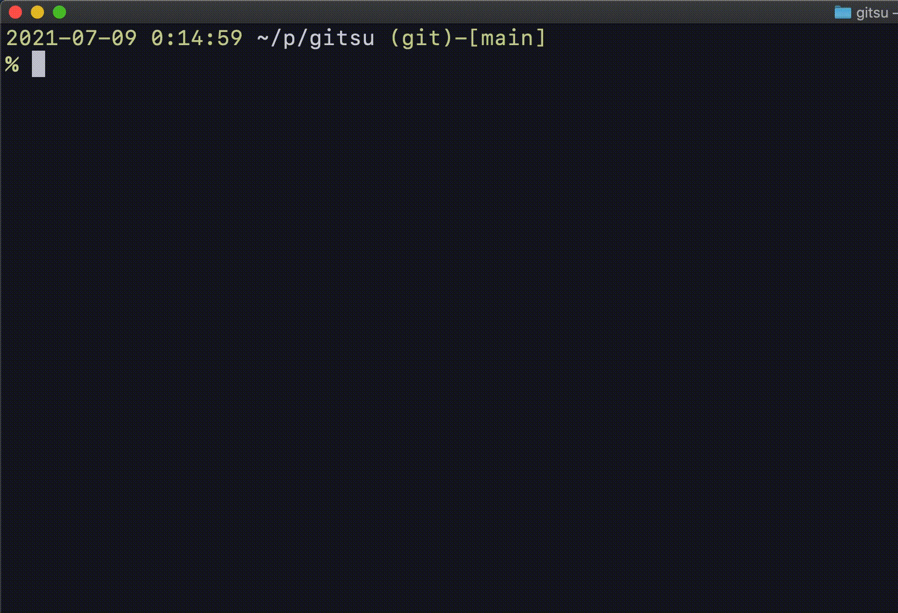

# gitsu

A simple cli tool for switching git user easily inspired by [Git-User-Switch](https://github.com/geongeorge/Git-User-Switch)



## Installation

Binary releases are [here](https://github.com/matsuyoshi30/gitsu/releases).

**Homebrew**

```bash
brew install matsuyoshi30/gitsu/gitsu
```

**Go (Not recommended)**

```bash
go get github.com/matsuyoshi30/gitsu
```

## Usage

```bash
USAGE:
   git su [global options] command [command options] [arguments...] # via Homebrew
   gitsu [global options] command [command options] [arguments...]  # via go get

COMMANDS:
   delete, d  Delete existing user
   modify, m  Modify existing user
   select, s  Select existing user
   reset, r   Remove all saved user profiles
   init, i    Initialize user config by providing an alias
   add, a     Add new user
   help, h    Shows a list of commands or help for one command
```

## LICENSE

[MIT](LICENSE)
